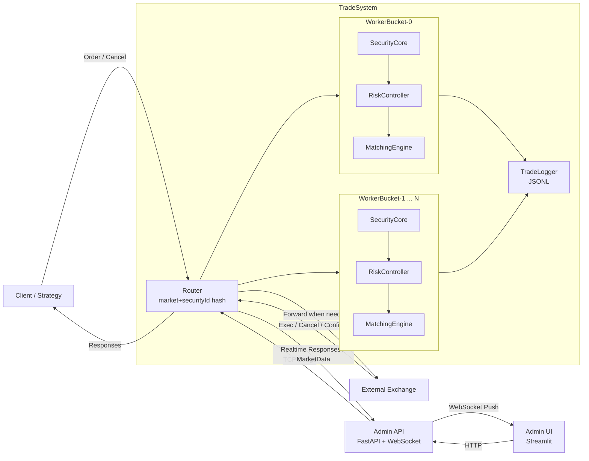

# 发际线保卫队

模拟股票交易中的撮合与风控系统。系统可作为**纯撮合交易所**独立运行，也可作为**交易所前置**在客户端与交易所之间进行内部撮合和对敲检测。

---

## 项目结构

```
├── include/                       # 头文件
│   ├── types.h                    # 数据结构（Order, CancelOrder, MarketData 等）
│   ├── constants.h                # 错误码常量
│   ├── matching_engine.h          # 撮合引擎接口
│   ├── risk_controller.h          # 风控引擎接口
│   ├── security_core.h            # 单证券核心业务单元（风控+撮合+状态管理）
│   ├── trade_system.h             # 交易系统主控接口（多 Bucket 并行架构）
│   ├── trade_logger.h             # 交易日志记录器接口
│   └── admin_server.h             # 管理后台 HTTP 服务接口
├── src/                           # 实现
│   ├── matching_engine.cpp        # 撮合引擎实现
│   ├── risk_controller.cpp        # 风控引擎实现
│   ├── security_core.cpp          # 单证券核心业务单元实现
│   ├── trade_system.cpp           # 交易系统主控实现（路由、WorkerBucket、MPSC 队列）
│   ├── trade_logger.cpp           # 交易日志记录器实现
│   └── admin_server.cpp           # 管理后台 HTTP 服务实现
├── tests/                         # 单元测试
│   ├── json_test.cpp              # JSON 解析 / 枚举转换测试
│   ├── matching_test.cpp          # 撮合引擎测试
│   ├── risk_test.cpp              # 风控引擎测试
│   ├── exchange_test.cc           # 纯撮合模式集成测试
│   ├── gateway_test.cc            # 交易所前置模式集成测试
│   ├── requirement_test.cpp       # 项目书要求一一对应测试
│   ├── trade_logger_test.cpp      # 交易日志测试
│   └── example_test.cc            # 示例测试
├── benchmarks/                    # 性能基准测试
│   ├── benchmark.cpp              # 单线程全链路吞吐量 / 延时测试
│   ├── bench_matching.cpp         # 撮合引擎裸性能专项测试
│   ├── bench_concurrent.cpp       # 并发扩展性测试
│   ├── bench_multicore.cpp        # 多 Bucket 并行扩展性测试
│   └── bench_network.cpp          # 网络性能测试
├── examples/                      # 示例程序
│   ├── exchange.cpp               # 纯撮合模式示例
│   ├── pre_exchange.cpp           # 交易所前置模式示例
│   ├── admin_main.cpp             # 管理后台程序
│   └── generate_history.cpp       # 历史数据生成工具
├── admin/                         # 管理后台前端（Python）
│   ├── app.py                     # Streamlit 前端
│   ├── server.py                  # FastAPI 后端
│   ├── bridge.py                  # C++ 后端桥接
│   ├── protocol.py                # 通信字段定义
│   ├── requirements.txt           # Python 依赖
│   └── start.sh                   # 启动脚本
├── scripts/                       # 数据生成与分析脚本
│   ├── generate_orders.py         # 生成测试订单数据
│   ├── analyze_history.py         # 历史成交数据分析脚本
│   └── analyze_history.ipynb      # 数据分析结果展示
├── docs/                          # 文档
│   ├── task_breakdown.md          # 项目分工表
│   ├── how_to_contribute.md       # 贡献指南
│   └── benchmarks/                # 性能测试记录
└── CMakeLists.txt
```

## 系统设计框架



说明：
- 前置模式下，订单先进入 `TradeSystem`，先做风控与内部撮合，再决定是否转发交易所。
- 系统按 `market + securityId` 路由到不同 `WorkerBucket`，每个 bucket 串行处理以降低锁竞争。
- 管理后台通过 `FastAPI` + `WebSocket` 获取实时回报与行情，通过 `TradeLogger` 落盘审计。


## 文档

- [**项目分工表**](docs/task_breakdown.md) — 任务列表、认领表
- [**贡献指南**](docs/how_to_contribute.md) — 如何参与开发
- [**管理后台设计**](docs/admin_ui_design.md) — Admin 前后端设计说明
- [**撮合引擎设计**](docs/matching_engine_development.md) — MatchingEngine 开发文档
- [**风控模块设计**](docs/risk_controller_development.md) — RiskController 开发文档
- [**风控优化记录**](docs/risk_controller_optimization.md) — 风控优化过程与结果
- [**日志模块设计**](docs/trade_logger_development.md) — TradeLogger 开发文档
- [**性能记录 v1**](docs/benchmarks/benchv1.md) — 基础版基准测试结果
- [**性能记录 v2**](docs/benchmarks/benchv2.md) — 改进matching后的基准测试结果
- [**性能记录 v2 (Native)**](docs/benchmarks/benchv2-native.md) — 改进matching后，在本机的基准测试结果
- [**性能记录 v3**](docs/benchmarks/benchv3.md) — 重构后的基准测试结果
- [**性能记录 v3 (Native)**](docs/benchmarks/benchv3-native.md) — 重构后，在本机的测试结果
- [**性能记录 v4**](docs/benchmarks/benchv4.md) — 进一步优化后的测试结果

## 编译与运行

### 环境要求

仅在Linux上进行过测试，
构建时需要ninja构建工具，Ubuntu系统可以通过以下命令安装：

```bash
sudo apt install ninja-build
```

如果要运行ui界面，还需要python和相应的依赖，仅在Python 3.13.12上测试过：

```bash
pip install -r admin/requirements.txt
```

### 运行

### 运行测试

```bash
cmake -B build -S . -DCMAKE_BUILD_TYPE=Release -DCMAKE_EXPORT_COMPILE_COMMANDS=1
cmake --build build --target unit_tests -j$(nproc)

./bin/unit_tests
```

### 运行ui

首先启动后台系统：

```bash
-j$(nproc)
cmake --build build --target admin_main -j$(nproc)

./bin/admin_main
```

然后启动前台ui：

```bash
cd admin
./start.sh
```

然后按照提示在浏览器访问 `http://localhost:30000` 即可。

## 项目交付材料

### 基础目标和部分高级目标

包括`2.1.1. 交易转发`、`2.1.2. 对敲风控`、`2.1.3. 模拟撮合`、`2.2.1. 行情接入`、`2.2.2. 撤单支持`，
在`tests/requirement_test.cpp`中，每个项目书要求对应一个测试用例，确保所有要求都被覆盖。

### 管理后台

ui管理界面可以通过上面的运行说明启动，包含订单簿、成交回报、拒绝回报和市场数据等等内容的实时展示。详细设计说明见[管理后台设计](docs/admin_ui_design.md)。

### 数据分析

交易历史记录存储功能通过`TradeLogger`实现，日志以JSONL格式落盘，包含订单事件、成交事件、市场数据等。可以使用Python等工具进行后续分析。详细设计说明见[日志模块设计](docs/trade_logger_development.md)。

#### 测试流程

首先通过python脚本生成交易订单：

```bash
python scripts/generate_orders.py
```

订单会被写入 `data/generated_orders.jsonl`，然后运行生成的订单：

```bash
cmake --build build --target generate_history -j$(nproc)
./bin/generate_history
```

生成的历史数据会被写入 `data/history.jsonl`，然后可以通过python脚本进行简单的分析：

```bash
python scripts/analyze_history.py
```

`scripts/analyze_history.ipynb`展示了完整的分析内容和结果。

### 性能优化

交易系统的性能优化主要集中在撮合引擎和并发处理上。通过逐步优化算法设计、数据结构和并发模型，显著提升了系统的吞吐量和延时表现。详细的优化过程和结果记录见[性能记录](docs/benchmarks/benchv1.md)、[性能记录 v2](docs/benchmarks/benchv2.md)和[性能记录 v3](docs/benchmarks/benchv3.md)。

#### `benchv1.md`

这是在matching engine优化前的性能测试结果，通过perf运行测试后，发现matching engine的性能瓶颈较为明显，原因是算法设计问题，把所有的证券都放在一个订单簿里，导致每次撮合都要遍历整个订单簿，查找符合证券id的订单成交，随着证券数量的增加，性能急剧下降。

#### `benchv2.md`

matching engine优化后的性能测试结果，优化后每个证券有独立的订单簿，撮合时只需访问对应证券的订单簿，性能大幅提升。

然而，系统仍然是单线程的，后续的`bench_concurrent`测试了多个线程并发提交订单的性能，发现全局锁竞争严重，吞吐量随着线程数增加反而下降。

#### `benchv3.md`

引入了异步提交模型（MPSC 队列）和分桶并行（multi-bucket）两大优化方案，显著提升了并发性能和扩展性。通过`bench_concurrent`测试，Queue 模式在多线程场景下的吞吐量远超 Mutex 模式；通过`bench_multicore`测试，增加 bucket 数后吞吐量提升，验证了分桶并行的有效性。且订单的最大延时也得到控制，整体性能表现优于之前的版本。

#### `benchv4.md`

通过`perf record`对`bench_multicore`进行性能分析，发现很多CPU时间消耗在`nlohmann::json`的生命周期操作（堆分配 / 释放 / 深拷贝 / 红黑树遍历）。根本原因是每笔订单的JSON对象（内部为 `std::map<string, json>`）在入队时被深拷贝到命令队列，在Worker线程中再次解析，然后销毁——每个 JSON 节点都涉及多次堆操作。

优化方案：将JSON解析提前到提交线程（`submitOrder` / `submitCancel`），命令队列中传递轻量的结构体（`Order` / `CancelOrder`）而非JSON对象，Worker线程直接使用已解析的结构体进行风控和撮合，仅在需要转发到外部交易所时才重新构建JSON。通过`bench_multicore`测试（100 证券、5000 股东、100 万订单），8 bucket 下吞吐量从v3的828K ops/s 提升至1.31M ops/s（+58%），验证了减少堆内存clone对并发性能的显著提升效果。

## 项目开发记录

- 基础框架与文档初始化：
  - [PR #1：基础框架 & 基本文档](https://github.com/JunkuiZhang/hairline-defense-force/pull/1)（[@张峻魁](https://github.com/junkuizhang)）
- 风控引擎基础实现：
  - [PR #3：[模块A] 实现风控引擎（对敲检测）功能](https://github.com/JunkuiZhang/hairline-defense-force/pull/3)（[@包一帆](https://github.com/LegendFan1104)）
  - 风控引擎性能优化：
    - [PR #11：[模块A] 风控引擎性能优化（扁平化索引）](https://github.com/JunkuiZhang/hairline-defense-force/pull/11)（[@赵俊岚](https://github.com/zjl619)）
- 撮合引擎核心实现：
  - [PR #13：feat: 实现撮合引擎核心功能 (模块B)](https://github.com/JunkuiZhang/hairline-defense-force/pull/13)
  - 撮合模块部分优化：
    - [PR #14：Feature/matching engine](https://github.com/JunkuiZhang/hairline-defense-force/pull/14)（[@汤语涵](https://github.com/Animnia)）
  - 撮合引擎性能优化：
    - [PR #34：修复matching引擎](https://github.com/JunkuiZhang/hairline-defense-force/pull/34)（[@李彦贝](https://github.com/KKBEIBEI)、[@张峻魁](https://github.com/junkuizhang)）
- 行情信息接入：
  - [PR #28：正确处理行情数据](https://github.com/JunkuiZhang/hairline-defense-force/pull/28)（[@梁家栋](https://github.com/du0729)）
- 管理界面实现：
  - [PR #19：增加管理页面+bug修复](https://github.com/JunkuiZhang/hairline-defense-force/pull/19)（[@张峻魁](https://github.com/junkuizhang)）
- 数据分析实现：
  - [PR #29：数据分析基础实现](https://github.com/JunkuiZhang/hairline-defense-force/pull/29)（[@张峻魁](https://github.com/junkuizhang)）
- 性能测试：
  - [PR #32：添加性能测试和几项性能改进](https://github.com/JunkuiZhang/hairline-defense-force/pull/32)（[@张峻魁](https://github.com/junkuizhang)）
  - [PR #35：重构系统](https://github.com/JunkuiZhang/hairline-defense-force/pull/35)（[@张峻魁](https://github.com/junkuizhang)）
  - [PR #40：减少堆内存clone](https://github.com/JunkuiZhang/hairline-defense-force/pull/40)（[@张峻魁](https://github.com/junkuizhang)）

