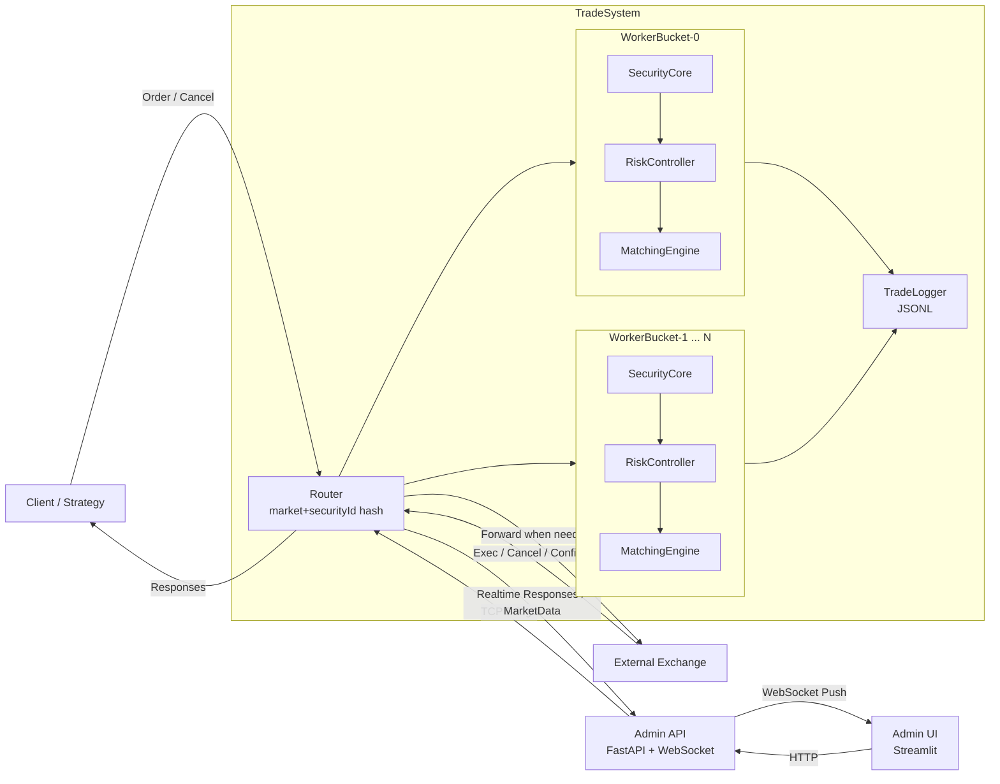

# 发际线保卫队

模拟股票交易中的撮合与风控系统。系统可作为**纯撮合交易所**独立运行，也可作为**交易所前置**在客户端与交易所之间进行内部撮合和对敲检测。

---

## 项目结构

```
├── include/                       # 头文件
│   ├── types.h                    # 数据结构（Order, CancelOrder, MarketData 等）
│   ├── constants.h                # 错误码常量
│   ├── matching_engine.h          # 撮合引擎接口
│   ├── risk_controller.h          # 风控引擎接口
│   ├── security_core.h            # 单证券核心业务单元（风控+撮合+状态管理）
│   ├── trade_system.h             # 交易系统主控接口（多 Bucket 并行架构）
│   ├── trade_logger.h             # 交易日志记录器接口
│   └── admin_server.h             # 管理后台 HTTP 服务接口
├── src/                           # 实现
│   ├── matching_engine.cpp        # 撮合引擎实现
│   ├── risk_controller.cpp        # 风控引擎实现
│   ├── security_core.cpp          # 单证券核心业务单元实现
│   ├── trade_system.cpp           # 交易系统主控实现（路由、WorkerBucket、MPSC 队列）
│   ├── trade_logger.cpp           # 交易日志记录器实现
│   └── admin_server.cpp           # 管理后台 HTTP 服务实现
├── tests/                         # 单元测试
│   ├── json_test.cpp              # JSON 解析 / 枚举转换测试
│   ├── matching_test.cpp          # 撮合引擎测试
│   ├── risk_test.cpp              # 风控引擎测试
│   ├── exchange_test.cc           # 纯撮合模式集成测试
│   ├── gateway_test.cc            # 交易所前置模式集成测试
│   ├── requirement_test.cpp       # 项目书要求一一对应测试
│   ├── trade_logger_test.cpp      # 交易日志测试
│   └── example_test.cc            # 示例测试
├── benchmarks/                    # 性能基准测试
│   ├── benchmark.cpp              # 单线程全链路吞吐量 / 延时测试
│   ├── bench_matching.cpp         # 撮合引擎裸性能专项测试
│   ├── bench_concurrent.cpp       # 并发扩展性测试
│   ├── bench_multicore.cpp        # 多 Bucket 并行扩展性测试
│   └── bench_network.cpp          # 网络性能测试
├── examples/                      # 示例程序
│   ├── exchange.cpp               # 纯撮合模式示例
│   ├── pre_exchange.cpp           # 交易所前置模式示例
│   ├── admin_main.cpp             # 管理后台示例（HTTP API + WebSocket）
│   └── generate_history.cpp       # 历史数据生成工具
├── admin/                         # 管理后台前端（Python）
│   ├── app.py                     # Streamlit 前端
│   ├── server.py                  # FastAPI 后端
│   ├── bridge.py                  # C++ 后端桥接
│   ├── protocol.py                # 通信字段定义
│   ├── requirements.txt           # Python 依赖
│   └── start.sh                   # 启动脚本
├── docs/                          # 文档
│   ├── task_breakdown.md          # 项目分工表
│   ├── how_to_contribute.md       # 贡献指南
│   └── benchmarks/                # 性能测试记录
└── CMakeLists.txt
```

## 系统设计框架



说明：
- 前置模式下，订单先进入 `TradeSystem`，先做风控与内部撮合，再决定是否转发交易所。
- 系统按 `market + securityId` 路由到不同 `WorkerBucket`，每个 bucket 串行处理以降低锁竞争。
- 管理后台通过 `FastAPI` + `WebSocket` 获取实时回报与行情，通过 `TradeLogger` 落盘审计。


## 文档

- [**项目分工表**](docs/task_breakdown.md) — 任务列表、认领表
- [**贡献指南**](docs/how_to_contribute.md) — 如何参与开发
- [**管理后台设计**](docs/admin_ui_design.md) — Admin 前后端设计说明
- [**撮合引擎设计**](docs/matching_engine_development.md) — MatchingEngine 开发文档
- [**风控模块设计**](docs/risk_controller_development.md) — RiskController 开发文档
- [**风控优化记录**](docs/risk_controller_optimization.md) — 风控优化过程与结果
- [**日志模块设计**](docs/trade_logger_development.md) — TradeLogger 开发文档
- [**性能记录 v1**](docs/benchmarks/benchv1.md) — 基础版基准测试结果
- [**性能记录 v2**](docs/benchmarks/benchv2.md) — 改进matching后的基准测试结果
- [**性能记录 v2 (Native)**](docs/benchmarks/benchv2-native.md) — 改进matching后，在本机的基准测试结果
- [**性能记录 v3**](docs/benchmarks/benchv3.md) — 重构后的基准测试结果
- [**性能记录 v3 (Native)**](docs/benchmarks/benchv3-native.md) — 重构后，在本机的测试结果

## 编译与运行

### 环境要求

仅在Linux上进行过测试，
构建时需要ninja构建工具，Ubuntu系统可以通过以下命令安装：

```bash
sudo apt install ninja-build
```

如果要运行ui界面，还需要python和相应的依赖，仅在Python 3.13.12上测试过：

```bash
pip install -r admin/requirements.txt
```

### 运行

### 运行测试

```bash
cmake -B build -S . -DCMAKE_BUILD_TYPE=Release -DCMAKE_EXPORT_COMPILE_COMMANDS=1
cmake --build build --target unit_tests -j$(nproc)

./bin/unit_tests
```

### 运行ui

首先启动后台系统：

```bash
-j$(nproc)
cmake --build build --target admin_main -j$(nproc)
./bin/admin_main
```

然后启动前台ui：

```bash
cd admin
./start.sh
```

然后按照提示在浏览器访问 `http://localhost:30000` 即可。

## 项目交付材料

### 基础目标和部分高级目标

包括`2.1.1. 交易转发`、`2.1.2. 对敲风控`、`2.1.3. 模拟撮合`、`2.2.1. 行情接入`、`2.2.2. 撤单支持`，
在`tests/requirement_test.cpp`中，每个项目书要求对应一个测试用例，确保所有要求都被覆盖。

### 管理后台

ui管理界面可以通过上面的运行说明启动，包含订单簿、成交回报、拒绝回报和市场数据等等内容的实时展示。详细设计说明见[管理后台设计](docs/admin_ui_design.md)。

### 数据分析


