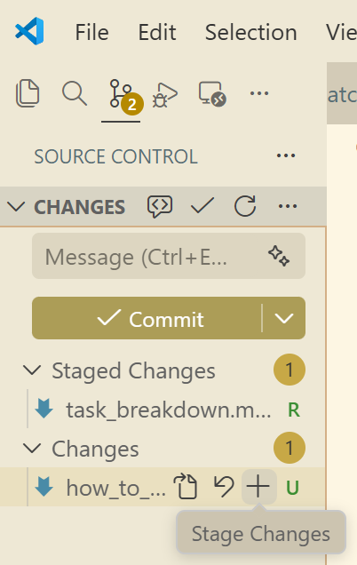
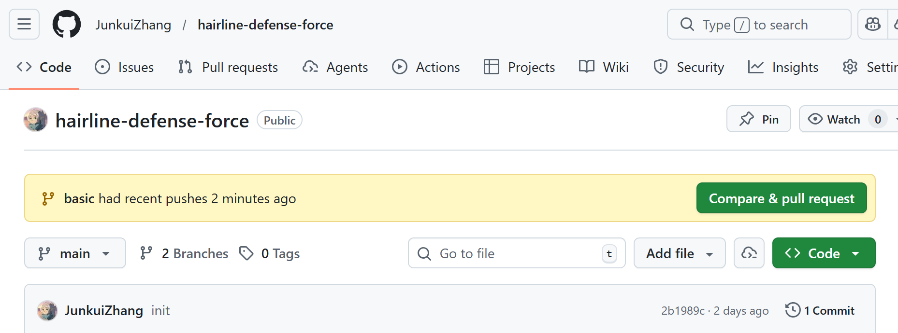

# 贡献 PR（Pull Request）说明


本文件面向希望为本仓库贡献代码、文档或测试的团队成员与协作者。

注：为避免大家需要 fork、同步上游等额外步骤，仓库已对团队成员开放写入权限，大家按照流程即可直接在本仓库创建分支并提交 PR。对于习惯 fork 工作流的同学，也可以先 fork 后按常规流程操作。

**快速概览**
- 从本仓库新建分支 → 本地开发、构建与运行测试 → 推送分支到本仓库 → 创建 PR → 等待PR合并 → 合并并清理分支


工作流程如下：

### 1. 克隆本仓库：

```bash
git clone https://github.com/JunkuiZhang/hairline-defense-force.git
cd hairline-defense-force
```

或者使用 SSH：

```bash
git clone git@github.com:JunkuiZhang/hairline-defense-force.git
cd hairline-defense-force
```

### 2. 基于main分支新建分支并推送到上游仓库：

**注意，在创建分支前请确保你的本地main分支是最新的：**
```bash
git fetch origin
```

然后创建新分支并推送：
```bash
git switch -c feature/awesome-improvement
git push -u origin feature/awesome-improvement
```

其中`feature/awesome-improvement` 是你新分支的名称。

### 3. 在该分支上进行开发、构建和测试，确保所有更改都在本地验证通过后再推送到上游仓库。

编译并运行测试：

```bash
cmake --build build --target unit_tests
./bin/unit_tests
```

git add、commit并推送更改：

```bash
git add .
git commit -m "Add awesome improvement"
git push
```

上面的`git add .`会添加所有更改的文件，你也可以选择性地添加特定文件。

一般而言，不要把你所有的更改都放在一个 commit 中，保持 commit 的粒度适中，便于评审和回滚。

另外，建议使用IDE或编辑器的 Git 插件来管理分支、提交和推送，这样可以更直观地看到变更和历史。如VS Code的图形化git操作：



### 4. 在 GitHub 上打开 PR：

当你把更改推送到上游后，打开本仓库的 GitHub 页面，会提示你创建PR：



点击 "Compare & pull request"，进入 PR 创建页面：


**PR 模板（示例）**

```
## 变更说明
- 简要描述本 PR 做了哪些改动

## 工作内容
- 本PR完成了哪些任务（可以参考任务列表），如果是多个任务，可以分点列出

## 其他说明
- 任何需要评审特别关注的点或已知限制
```

另外要注意的是，在本地修改并提交到同一分支，推送后 PR 会自动更新。

